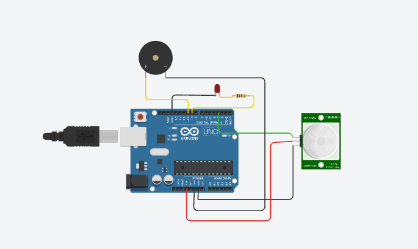

# PIR Home Security Alarm System

## Circuit Diagram

---

## Overview

A motion detection-based home security system using Arduino Uno and PIR sensor.

---

## Features

- Motion detection
- LED alert indication
- Piezo buzzer alarm
- Real-time intrusion detection

---

## Components Used

- Arduino Uno
- PIR Sensor
- Piezo Buzzer
- LED
- 220Ω Resistor

---

## Software Used

- Tinkercad
- Arduino IDE

---

## Working Principle

The PIR sensor detects motion and sends a digital signal to Arduino Uno. The Arduino processes the signal and activates the LED and piezo buzzer to indicate intrusion detection.

---

## Code Logic

- PIR sensor output is continuously monitored using digitalRead().
- If motion is detected, the LED and buzzer are activated.
- If no motion is detected, the system remains idle.

---

## Future Improvements

- LCD display integration
- GSM alert notification
- IoT-based remote monitoring
- Password-based deactivation system

  ## Simulation Link

[Tinkercad Simulation] https://www.tinkercad.com/things/8MTetqvGkTp-home-security-alarm-system-

